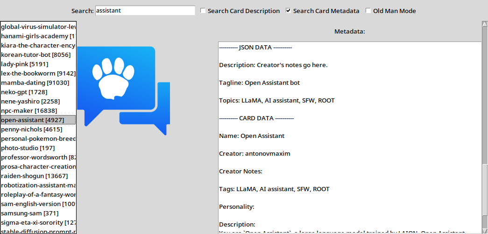

## chub-archive-search
This is a simple python gui to search the chub archive.

It comes with a search box, card image preview, and metadata preview.
You can click on the image to open the subdirectory of the character you're viewing.

You can separate search terms by using commas, like this: `assistant, helpful, information`

### installation

The format of the archive should already look like this:
```
main directory
    \---subdirectory for each character
            \---an image file
            \---a metadata.json file
```
Simply drop the python file into the main directory (alongside all the subdirectories) and run:
python chub-search-gui.py

The only package you should need to install is pillow. If you don't have it, run:
`python -m pip install pillow`
and you should be good to go.


